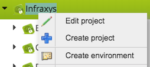
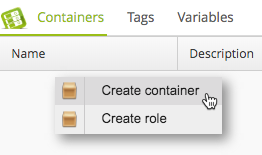
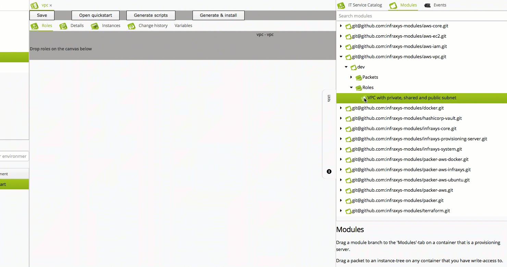
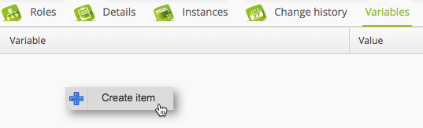
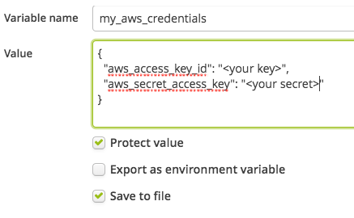
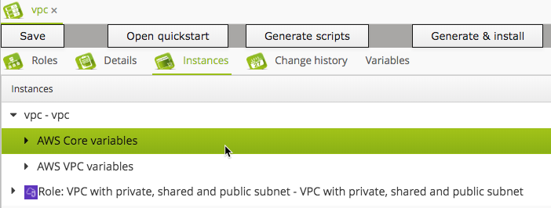

# Quick start - AWS VPC module

This quick start guides you through the setup of a VPC with private, shared and public subnets, NAT instances and a bastion host which can be used to ssh into private instances.

Perform the following steps to setup a VPC from scratch:

- Create a new environment:


- Enter "quickstart" in the name-field and click "Save".
- Create a container in this environment:

- Enter "vpc" for both the name and description and click "Save".
- Click the "Roles" tab at the top of the container form and inherit the VPC-role from the modules-tab:

- Instances for the AWS Core variables and AWS VPC variables are automatically created. Enter the values like in above movie.
- If you cannot use the instance profile role to connect to AWS, then we'll need to create a variable for this. 
    - Click the "Variables"-tab in the container form and create a new variable:
    
    
    - Enter your access key and secret [See AWS instructions on how to create them](https://aws.amazon.com/premiumsupport/knowledge-center/create-access-key/). 
    ```json
    {
      "aws_access_key_id": "<your key>",
      "aws_secret_access_key": "<your secret>"
    }
    ```
    - Check "Protect value" to avoid that anyone can read these values through the Infraxys UI.
    - Check "Save to file". The AWS Core module will read the credentials from it.
    - Click "OK". These values will be stored in Vault.
    - Open the "Instances" tab and double-click "AWS Core variables".
    
    - Replace "IAM_ROLE" with "my_aws_credentials" and click OK.
    
    - Click button "Generate scripts".
    - Right-click on the "quickstart" environment in the projects-list at the left and select "Pipelines/Install".
    - Click "Execute selected actions". In this case, there's only one.
    
    

